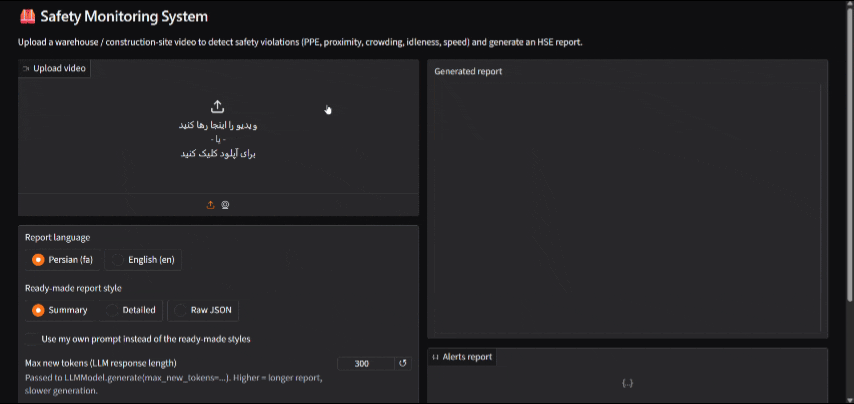

<div align="center">

# 🦺 Safety Monitoring System

### Intelligent Workplace Safety Monitoring using Computer Vision & LLMs

Detect real-time safety violations on construction sites, factories, and warehouses using YOLO, a Rule Engine, and an LLM-powered reporting layer.


</div>

## 🎥 Demo

<p align="center">
  
</p>

---

# 📑 Table of Contents

- [📖 Overview](#-overview)
- [✨ Features](#-features)
- [🏗 Project Structure](#-project-structure)
- [📊 Dataset](#-dataset)
- [🛠 Tech Stack](#-tech-stack)
- [⚙ Pipeline](#-pipeline)
- [🤖 Detected Classes & Safety Rules](#-detected-classes--safety-rules)
- [📈 Model Performance](#-model-performance)
- [📈 Evaluation Metrics](#-evaluation-metrics)
- [🚀 Installation](#-installation)
- [▶ Running the System](#-running-the-system)
- [🎥 Demo Video](#-demo-video)
- [📊 Example Alert & Report](#-example-alert--report)
- [👥 Team](#-team)
- [🤝 Contributing](#-contributing)
- [⭐ Support](#-support)
- [📄 License](#-license)

---

# 📖 Overview

Workplace safety violations — missing PPE, machinery operating too close to workers, unauthorized access to hazardous zones — cause serious injuries and financial losses every year across construction sites, factories, and warehouses.

This project builds an **end-to-end AI safety monitoring pipeline** that turns any existing site camera into an automated safety observer, capable of detecting violations in real time and generating management-ready reports.

The project is designed as a complete, production-oriented application including:

- Object detection & multi-object tracking
- Rule-based violation analysis
- Event storage & REST API
- Real-time monitoring dashboard
- LLM-powered daily/weekly HSE reporting

---

# ✨ Features

- Real-time multi-class object detection (PPE, personnel, vehicles, machinery)
- Persistent object tracking across video frames
- PPE-to-worker association (hardhat / vest compliance)
- Configurable rule engine (8 industrial safety rules)
- Proximity, crowd-density, idleness, and abnormal-speed detection
- Structured event storage in PostgreSQL via FastAPI
- Live monitoring dashboard with real-time stats and alerts
- LLM-generated daily/weekly HSE reports (Persian / English)
- Fully configurable thresholds for every safety rule

---

# 🏗 Project Structure

```text
IAI-001-Safety-Monitoring-System/
│
├── API/                        # FastAPI backend (single integration point)
│   ├── app.py                  #   GET /health, POST /analyze
│   ├── Dockerfile
│   └── requirements.txt
│
├── UI/                         # Gradio front-end (talks to API over HTTP only)
│   ├── app.py
│   ├── Dockerfile
│   └── requirements.txt
│
├── YOLO/                       # Detection + tracking + rule engine
│   ├── mains.py                #   SafetyVideoPipeline, standalone CLI entry point
│   ├── rules_eng.py            #   RuleEngine (8 safety rules)
│   ├── Train.py                #   YOLOv8 training script
│   ├── alert_test/
│   └── models/
│       └── best.onnx           #   production detector weights
│
├── LLM/                        # Local LLM (Qwen2.5) report generation
│   ├── llm_client.py           #   LLMModel (Hugging Face, CUDA-only inference)
│   ├── prompt.py                #   HSEPromptGenerator / AlertsSummarizer
│   ├── models.py                #   Pydantic schemas for report I/O
│   ├── llm_main.py              #   standalone LLM CLI entry point (WIP)
│   └── tests/
│
├── Docs/                       # Team technical reports & docs
│   ├── Dashboard + API/
│   ├── LLM/
│   ├── YOLO/
│   └── final_report/
│
├── docker-compose.yml           # orchestrates the `api` + `ui` containers
├── pyproject.toml / uv.lock     # dependency management (uv)
├── requirements.txt             # generated from pyproject.toml (uv pip compile)
├── TEAM.md
├── LICENSE
└── README.md
```

---

# 📊 Dataset

This project uses the **Construction Site Safety Image Dataset**, a Roboflow-exported, YOLO-format benchmark for PPE and workplace-hazard detection.

> **Source:** Construction Site Safety Image Dataset (Kaggle / Roboflow)

📂 **View Dataset:**
[Construction Site Safety Image Dataset](https://www.kaggle.com/datasets/snehilsanyal/construction-site-safety-image-dataset-roboflow)

### Dataset Statistics

| Property | Value |
|-----------|--------|
| Images | 2,801 |
| Classes | 10 |
| Format | YOLOv8 (Ultralytics-ready) |
| Size | ~1.2 GB |
| Split | Train / Valid / Test (pre-split) |
| Target | Multi-class Object Detection |

The dataset ships pre-labeled and pre-split, allowing the team to move directly into model training and system integration without manual annotation.

---

# 🛠 Tech Stack

## Computer Vision

- Ultralytics YOLOv8
- OpenCV
- ByteTrack

## Rule Engine

- Python
- Pydantic

## Backend

- FastAPI

## LLM / Reporting

- Hugging Face Transformers
- Qwen2.5-Instruct (local inference)
- Jinja2

## Front-end

- Gradio (video upload, language/style picker, custom-prompt mode)

## Deployment

- Docker + Docker Compose
- uv (Python dependency management)

## Version Control

- Git
- GitHub

---

# ⚙ Pipeline

```
Site Camera
     │
     ▼
YOLOv8 Detection
     │
     ▼
ByteTrack Tracking
     │
     ▼
PPE ↔ Person Association
     │
     ▼
Rule Engine (8 Safety Rules)
     │
     ▼
     │
     ├──────────────► Dashboard (real-time)
     │
     ▼
LLM Report Generator
     │
     ▼
Daily / Weekly HSE Report
```

---

# 🤖 Detected Classes & Safety Rules

**Detected classes:** `Hardhat`, `NO-Hardhat`, `Safety Vest`, `NO-Safety Vest`, `Mask`, `Person`, `machinery`, `vehicle`, `Safety Cone`, and dataset-specific extensions.

**Implemented safety rules:**

- Vehicle–person proximity
- Machinery–person proximity
- Missing PPE (general)
- Missing hardhat
- Missing safety vest
- Prolonged worker idleness
- Crowd density
- Abnormal / high-speed movement

---

# 📈 Model Performance

The current production model is a fine-tuned **YOLOv8** trained on the Construction Site Safety dataset. Final benchmark numbers are being finalized by the Model Training & Evaluation teams and will be published here once validated.

| Metric | Score |
|:--------|------:|
| Model | YOLOv8 (fine-tuned) |
| mAP50 |  0.8169 |
| mAP50-95 | 0.5517 |
| Precision | 0.8371 |
| Recall | 0.8056 |
| F1-Score | 0.8210 |

> **Note:** As with any real-world detection task, model selection prioritizes **Precision, Recall, F1-Score, and mAP** per class over raw accuracy, since safety-critical classes (e.g. `NO-Hardhat`, `machinery`) matter far more than overall correctness.

---

# 📈 Evaluation Metrics

Since safety violation detection is a multi-class, safety-critical problem, multiple metrics are tracked:

- mAP50
- mAP50-95
- Precision
- Recall
- F1-Score

---

# 🚀 Installation

Clone repository

```bash
git clone https://github.com/AI-Builders-Iran/IAI-001-Safety-Monitoring-System.git
```

Enter project

```bash
cd IAI-001-Safety-Monitoring-System
```

Install dependencies (either works — `requirements.txt` is generated from `pyproject.toml` via `uv`):

```bash
# with uv (recommended, matches uv.lock)
uv sync

# or plain pip
pip install -r requirements.txt
```

> Report generation via `LLM/llm_client.py` requires an **NVIDIA GPU with CUDA** — it will raise at load time on CPU-only machines. Everything else (detection, tracking, rule engine, API without `/analyze`'s LLM step) runs fine on CPU.

---

# ▶ Running the System

There are three ways to run the project, from easiest to most manual.

## Option 1 — Docker Compose (recommended)

The system ships as two containers, orchestrated with `docker-compose.yml`:

| Service | What it does | Port |
|---|---|---|
| `api` | FastAPI backend. Loads the YOLO detector + rule engine (`YOLO/mains.py`, `YOLO/rules_eng.py`) and the local LLM (`LLM/llm_client.py`) once at startup and exposes them over HTTP. | `8000` |
| `ui` | Gradio front-end. Lets you upload a video, pick a report language/style, or flip a flag to send your own custom prompt instead of the ready-made templates. Talks to `api` over HTTP only. | `7860` |

**Requirements:** Docker + Docker Compose v2, and an NVIDIA GPU with the [NVIDIA Container Toolkit](https://docs.nvidia.com/datacenter/cloud-native/container-toolkit/latest/install-guide.html) installed on the host.

```bash
docker compose up -d --build
```

- Swagger UI (API docs): `http://localhost:8000/docs`
- Gradio UI: `http://localhost:7860`

**One-time step** — the Qwen2.5 weights aren't checked into the repo, so download them once into the persisted `llm_model_cache` volume, then restart the API:

```bash
docker compose exec api python -c "from LLM.llm_client import download_model; download_model('/app/LLM/model')"
docker compose restart api
```

Both services read their settings from environment variables set in `docker-compose.yml` (model paths, detection thresholds, upload size limit, request timeout) — adjust them there rather than editing the code.

## Option 2 — Run the API and UI locally (no Docker)

```bash
# Terminal 1 — API (FastAPI + YOLO + rule engine + LLM)
uvicorn API.app:app --reload --port 8000

# Terminal 2 — UI (Gradio)
python UI/app.py
```

By default the UI expects the API at `http://localhost:8000` (override with the `API_URL` env var). Key env vars for the API: `YOLO_MODEL_PATH` (default `YOLO/models/best.onnx`), `LLM_MODEL_PATH` (default `LLM/model`), `YOLO_CONF_THRESHOLD`, `YOLO_IOU_THRESHOLD`, `MAX_UPLOAD_MB`.

Once running:

- Swagger UI: `http://127.0.0.1:8000/docs`
- ReDoc: `http://127.0.0.1:8000/redoc`
- Gradio UI: `http://127.0.0.1:7860`

## Option 3 — Run just the YOLO + rule-engine pipeline (CLI, no API/LLM)

Useful for quickly testing detection + tracking + rules on a video without spinning up the API or downloading the LLM.

```bash
python YOLO/mains.py --video path/to/video.mp4 --model YOLO/models/best.onnx \
  --output result.json \
  --save-tracking tracking_raw.json \
  --save-alerts alerts_report.json
```

### Custom prompts (Gradio UI)

In the UI, checking **"Use my own prompt instead of the ready-made styles"** replaces the built-in Persian/English summary/detailed/JSON templates with whatever text you type — it's combined with a compact summary of that video's detected alerts before being sent to the LLM, so the model still has context.

---

# 🎥 Demo Video

<!--
  ⬇️ Add the project's test/demo video here.
  Easiest options:
    1. Upload the video as a GitHub "release asset" or directly via the
       README editor (drag & drop) — GitHub will host it and give you an
       embeddable link, then replace the line below with:
       https://github.com/AI-Builders-Iran/IAI-001-Safety-Monitoring-System/assets/<id>/<filename>.mp4
    2. Or link an external host (YouTube, Google Drive, etc.) and drop a
       thumbnail + link instead, e.g.:
       [](https://youtu.be/VIDEO_ID)
-->

*Demo video coming soon — will show the full pipeline end-to-end (video upload → YOLO detection/tracking → rule engine alerts → LLM-generated HSE report) via the Gradio UI.*

---

# 📊 Example Alert & Report

### Example Alert (Rule Engine Output)

```json
{
  "type": "machinery_person_proximity",
  "track_id": 4,
  "distance_m": 0.72,
  "severity": "critical",
  "message": "⚠️ Machinery 4 approached person 4! Distance: 0.72m"
}
```

### Example Daily HSE Report (LLM Output)

```
📋 Daily Report — July 14, 2026

Today, 24 warnings were registered in the workshop, of which:
• 15 cases: Worker without a helmet
• 5 cases: Forklift too close to workers
• 3 cases: Worker without a safety vest
• 1 case: Entering a dangerous area

Suggestions:
1. Re-train workers on the use of helmets
2. Install sound alarms near forklifts
3. Review night shift safety equipment
```

---

# 👥 Team

This project is developed by the **AI Builders Iran** team.

| Member | Contact | Role |
|--------|---------|------|
| Amirdevlp | [@Amirdevlp](https://t.me/Amirdevlp) | Lead — Dataset · Lead — Rule Engine · Core Member — Model Training & Tracking |
| Ryhnne7 | [@Ryhnne7](https://t.me/Ryhnne7) | Lead — Model Training (YOLO) & Tracking |
| SonayHajirezaei | [@SonayHajirezaei](https://t.me/SonayHajirezaei) | Lead — Evaluation · Core Member — Rule Engine |
| Hossein_h8304 | [@Hossein_h8304](https://t.me/Hossein_h8304) | Lead — LLM |
| FarshadZ1997 | [@FarshadZ1997](https://t.me/FarshadZ1997) | Lead — Dashboard & Backend |
| a_taherkho86 | [@a_taherkho86](https://t.me/a_taherkho86) | Core Member — Dataset |
| AJzahed | [@AJzahed](https://t.me/AJzahed) | Core Member — Model Training & Tracking |
| HiTech_Manage | [@HiTech_Manage](https://t.me/HiTech_Manage) | Core Member — Evaluation |
| thisisatestforid | [@thisisatestforid](https://t.me/thisisatestforid) | Core Member — Rule Engine |
| Mohii_Mhmdi | [@Mohii_Mhmdi](https://t.me/Mohii_Mhmdi) | Core Member — Rule Engine |
| Beeehrraaad | [@Beeehrraaad](https://t.me/Beeehrraaad) | Core Member — LLM |
| whatever0_00 | [@whatever0_00](https://t.me/whatever0_00) | Core Member — LLM |
| Erfanjenab86 | [@Erfanjenab86](https://t.me/Erfanjenab86) | Core Member — LLM |
| ArianaTheClown | [@ArianaTheClown](https://t.me/ArianaTheClown) | Core Member — Dashboard & Backend |

We collaborate to build an open-source, industrial-grade Computer Vision and AI safety system while learning and growing together.

---

# 🤝 Contributing

Contributions are always welcome.

1. Fork repository

2. Create new branch

```bash
git checkout -b feature/new-feature
```

3. Commit

```bash
git commit -m "Add new feature"
```

4. Push

```bash
git push origin feature/new-feature
```

5. Open Pull Request

> All code is reviewed via Pull Request before merging — no direct commits to the main branch. Please coordinate with your workstream's Lead before major changes.

---

# ⭐ Support

If you found this project useful,

please consider giving it a ⭐ on GitHub.

It helps the project grow.

---

# 📄 License

This project is licensed under the MIT License.
